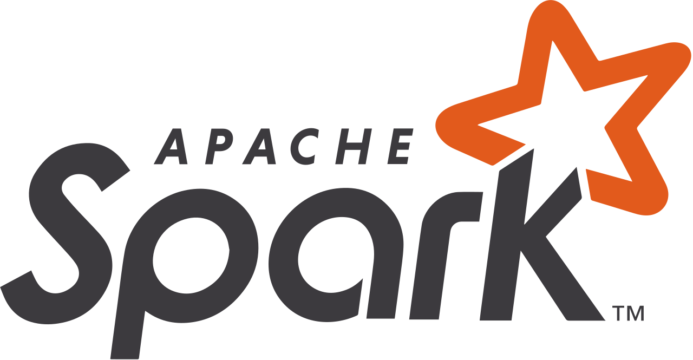

  
  <h1>PySpark Learning Notes</h1>
  
  

    Code snippets and notes related to PySpark from various sources
  

 

<!-- Table of Contents -->

# :notebook_with_decorative_cover: Table of Contents

- [About the Project](#star2-about-the-project)
- [Content](#book-Content)
- [Contact](#handshake-contact)
- [Acknowledgements](#gem-acknowledgements)

<!-- About the Project -->

## :star2: About the Project

Notes related to PySpark. Mainly taken from the official PySpark documnetation tutorials and FreeCodeCamp lessons

## :book: Content

1. [PySpark Official Documentation](https://spark.apache.org/docs/latest/index.html)

   - [Chapter 1: Quick Start](https://spark.apache.org/docs/latest/quick-start.html)
   - [Chapter 2: Spark SQL, DataFrames, Datasets](https://spark.apache.org/docs/latest/sql-getting-started.html)
   - [Chapter 3: Structure Streaming](https://spark.apache.org/docs/latest/structured-streaming-programming-guide.html)
   - [Chapter 4: RDD Programming](https://spark.apache.org/docs/latest/rdd-programming-guide.html)
   - [Chapter 5: Spark Streaming DStreams](https://spark.apache.org/docs/latest/streaming-programming-guide.html)
   - [Chapter 6: Machine Learning with MLib](https://spark.apache.org/docs/latest/ml-guide.html)
   - [Chapter 8: PySpark Guides](https://spark.apache.org/docs/latest/api/python/getting_started/quickstart_df.html)

2. [FCC: PySpark Tutorial](https://www.youtube.com/watch?v=_C8kWso4ne4&t=19s)

## :handshake: Contact

Author: Martin Ho

Project Link: [https://github.com/minimartzz/ml-design-patterns](https://github.com/minimartzz/ml-design-patterns)

<!-- Acknowledgments -->

## :gem: Acknowledgements

- FCC Tutorial - https://www.youtube.com/watch?v=_C8kWso4ne4&t=19s
